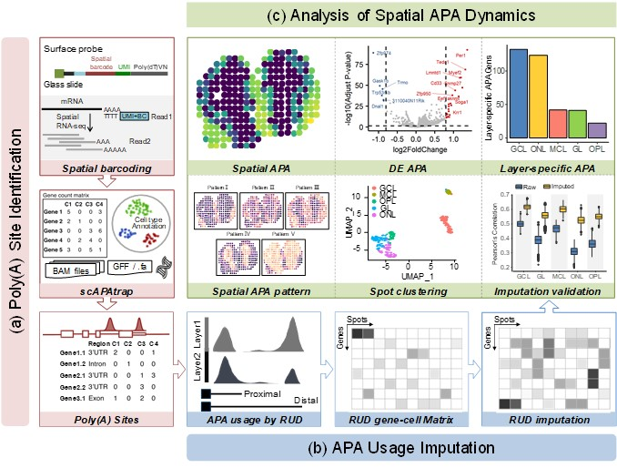

# stAPAminer
Analyze APA for spatially resolved transcriptomic studies

## About
stAPAminer first identifies poly(A) sites from spatial RNA-seq and then qantifies APA site usages in individual spots. Particularly, we imputes APA site usages with gene expression profiles to avoid high sparseness. Using stAPAminer, we can detect poly(A) sites from genes in MOB and found genes with spatial patterns of APA usage. Genes with spatial patterns of APA usage are predicted compared to genes with spatial patterns of gene expression.

* The stAPAminer package consists of three main modules.



A. Identification and quantification of APA from spatial transcriptomics data, then quantification and imputation of spatial APA usages.

B. Verify the correctness of the imputation method.

C. Identification of genes with differential APA usage between morphological layers and identification of APA genes with spatial patterns of APA usage variation

## Getting started
### Mandatory
* R (>=3.6.0). [R 3.6.3](https://www.r-project.org/) is recommended.

### Required R Packages
* movAPA, org.Mm.eg.db, Seurat, ggplot2, fdm2id, ClusterR, cluster, clusterSim, SPARK, limma, edgeR, ggpubr

### Installation
* Install the R package using the following commands on the R console:

```
install.packages("devtools")
require(devtools)
install_github("BMILAB/stAPAminer")
library(stAPAminer)
##or you can download ZIP, and then unzip
install.packages("you unzip file path", repos = NULL, type = "source")
```

## Application examples
### Qantifies and imputes APA site usages
```
library(stAPAminer)
##gene expression count
count<-read.csv(system.file("extdata", "count.csv", package = "stAPAminer"))
##individual spots and coordinates
position<-read.table(system.file("extdata", "position.txt", package = "stAPAminer"))
##movAPA Object
load(system.file("extdata", "APA.RDA", package = "stAPAminer"))
##Qantifies
RUD <- computeAPAIndex(APA,rownames(position))
##imputes
RUD <- imputeAPAIndex(RUD_RAW,count,k=10)
```
### Verify the correctness of the imputation method
```
##cluster
stObj <- createStAPAminerObject(RUD,position)
stObj <- makeStCluster(stObj,resolution = 0.6,dims = 1:10,k=30,nfeatures = 4500)
findLabels(stObj)
stObj <- RenameCluster(stObj,c("GCL","GL","ONL","OPL","MCL"))
drawClusterPlot(stObj,color=distinctColorPalette(5),islegend = T,size = 3)
##Verify
pearson_RUD <- computePearsonIndex(stObj,"RUD")
index <- computeIndex(stObj)
drawVolcano(stObj,"GCL","GL")
```
### Identification DEAPA, LSAPA and SVAPA 
```
stObj <- findContrastAPA(stObj)
stObj <- findAllMarkers(stObj,logFC = 0.5)
stObj <- findSVAPA(stObj)
geneSet <- findstAPASet(stObj)
##draw APA Spatial Express picture
drawSpatialExpress(stObj,"Pde1c")
```

## Citation

